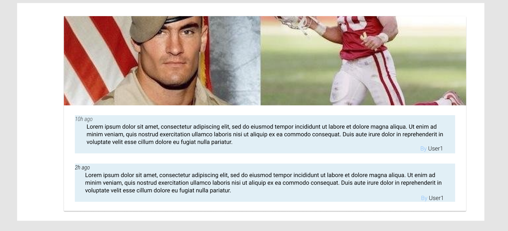
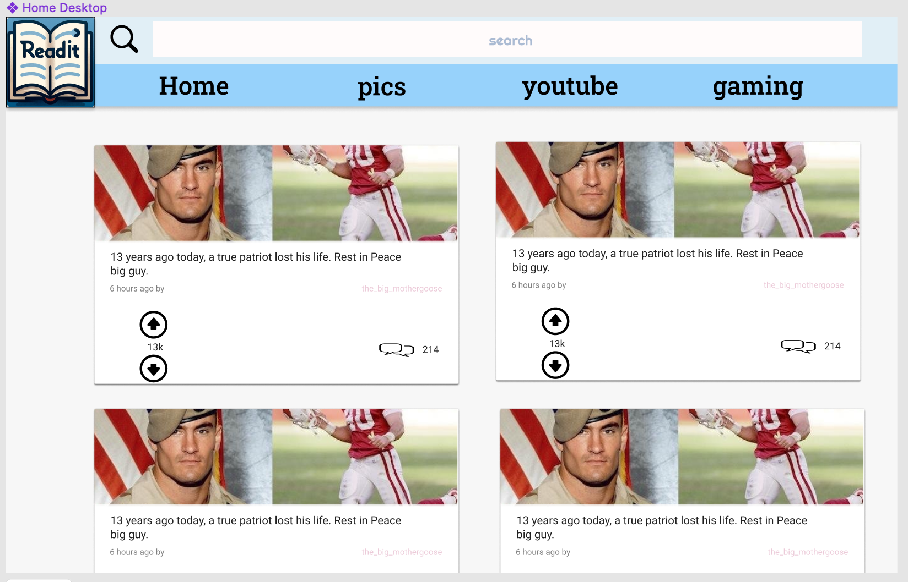

# ReadIt

RedIt is a third-party Reddit browser created as a final project of the Front-End Developer course from CodeCademy. The purpose of this project is to practically use and consolidate the knowledge I acquired.

## Ilustations

## Features

* **Selection** of one of several **subforums** to see posts filtered by popularity.

* **Displaying comments** with the number of likes and author under each of them.

* **Subreddit Search** to find specific subreddits. 

## Installation

ReadIt is a web-based application, which means there is no installation required. To run the app locally - copy all files from the github and paste them into empty project created with > npm using 'npx create-react-app' command.

## Technology Stack

* React

* Redux

## Project Status

Becouse ReadIt it is a project created for learning purposes, it does not contain unnecessary functionalities and is rather intended to consolidate knowledge. 
